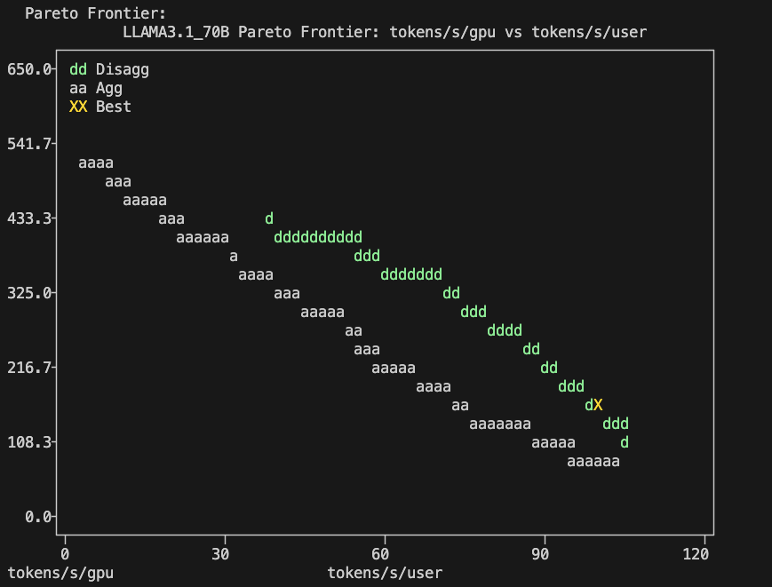
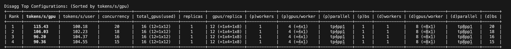

# Distributed Inference with Dynamo

This guide demonstrates deploying distributed inference with Dynamo on Kubernetes.

## Prerequisites

- Kubernetes cluster with GPU support
- `kubectl` and `helm` 3.x installed
- HuggingFace token from [huggingface.co/settings/tokens](https://huggingface.co/settings/tokens)

## 1. Single-Node-Sized Models hosting on multiple Nodes

For SNS (Single-Node-Sized) models, use Dynamo aggregated serving to deploy multiple replicas with KV cache-based routing.

### Step 1: Install Dynamo CRDs

**Note:** CRDs are cluster-wide resources and only need to be installed **once per cluster**. If already installed, skip to Step 2.

```sh
export RELEASE_VERSION=0.5.0  # Use Dynamo version 0.3.2 or higher

# Check if CRDs already exist
if kubectl get crd dynamographdeployments.nvidia.com &>/dev/null && \
   kubectl get crd dynamocomponentdeployments.nvidia.com &>/dev/null; then
    echo "✓ CRDs already installed, skipping to Step 2"
else
    echo "Installing Dynamo CRDs..."
    helm fetch https://helm.ngc.nvidia.com/nvidia/ai-dynamo/charts/dynamo-crds-${RELEASE_VERSION}.tgz
    helm install dynamo-crds dynamo-crds-${RELEASE_VERSION}.tgz --namespace default
    kubectl get crd | grep nvidia.com  # Verify installation
fi
```

### Step 2: Install Dynamo Platform

```sh
export NAMESPACE=your-namespace-here
export RELEASE_VERSION=0.5.0

kubectl create namespace ${NAMESPACE} 2>/dev/null || echo "Namespace already exists"
helm fetch https://helm.ngc.nvidia.com/nvidia/ai-dynamo/charts/dynamo-platform-${RELEASE_VERSION}.tgz

# Install or upgrade
if helm list -n ${NAMESPACE} | grep -q dynamo-platform; then
    helm upgrade dynamo-platform dynamo-platform-${RELEASE_VERSION}.tgz --namespace ${NAMESPACE}
else
    helm install dynamo-platform dynamo-platform-${RELEASE_VERSION}.tgz --namespace ${NAMESPACE}
fi

# Verify platform pods are running (wait ~2 minutes)
kubectl get pods -n ${NAMESPACE}
```

### Step 3: Configure and Deploy Model

#### Update Configuration (Required)

Before deploying, update `agg_router.yaml`:

1. **Replace `my-tag`** with your Dynamo version (e.g., `0.5.0`)
2. **Replace `/YOUR/LOCAL/CACHE/FOLDER`** with your cache path (e.g., `/data/huggingface-cache`)

```sh
cd examples/basics/kubernetes/Distributed_Inference

# Update image tag and cache path
sed -i 's/my-tag/0.5.0/g' agg_router.yaml
sed -i 's|/YOUR/LOCAL/CACHE/FOLDER|/data/huggingface-cache|g' agg_router.yaml

# Verify changes (should NOT show my-tag)
grep "image:" agg_router.yaml
```

#### Create HuggingFace Secret and Deploy

```sh
export HF_TOKEN=your_huggingface_token

kubectl create secret generic hf-token-secret \
    --from-literal=HF_TOKEN=${HF_TOKEN} \
    --namespace ${NAMESPACE}

# Deploy from dynamo root directory
kubectl apply -f examples/basics/kubernetes/Distributed_Inference/agg_router.yaml --namespace ${NAMESPACE}

# Monitor deployment (takes 4-6 minutes for first run)
kubectl get pods -n ${NAMESPACE} -w
```

**Deployment includes:**
- 1 Frontend pod with KV cache routing
- 4 Worker pods running Qwen/Qwen2.5-1.5B-Instruct
- Each worker gets 1 GPU

### Step 4: Test the Deployment

```sh
# Forward the service port
kubectl port-forward deployment/vllm-agg-router-frontend 8000:8000 -n ${NAMESPACE}
```

In a new terminal, test the endpoint:

**Simple test:**
```sh
curl localhost:8000/v1/chat/completions \
  -H "Content-Type: application/json" \
  -d '{
    "model": "Qwen/Qwen2.5-1.5B-Instruct",
    "messages": [{"role": "user", "content": "Hello! How are you?"}],
    "stream": false,
    "max_tokens": 50
  }'
```

**Expected response:**
```json
{
  "id": "chatcmpl-...",
  "choices": [{
    "message": {"content": "Hello! I'm just an artificial intelligence...", "role": "assistant"},
    "finish_reason": "stop"
  }],
  "usage": {"prompt_tokens": 35, "completion_tokens": 49, "total_tokens": 84}
}
```

**Test streaming:**
```sh
curl localhost:8000/v1/chat/completions \
  -H "Content-Type: application/json" \
  -d '{
    "model": "Qwen/Qwen2.5-1.5B-Instruct",
    "messages": [{"role": "user", "content": "Write a short poem about AI"}],
    "stream": true,
    "max_tokens": 100
  }'
```

You can also benchmark the performance of the endpoint by [AIPerf](https://github.com/ai-dynamo/aiperf/blob/main/README.md)

## 2. Deploy Single-Node-Sized Models using AIConfigurator

AIConfigurator helps users to find a strong starting configuration for disaggregated serving. We can use it as a guidance for the SNS (Single-Node-Sized) Model's serving.

### Step 1: Install AI Configurator
```sh
pip3 install aiconfigurator
```

### Step 2: Run Configuration Analysis

Assume we have 2 GPU nodes with 16 H200 in total, and we want to deploy Llama 3.1-70B-Instruct model with an optimal disaggregated serving configuration. Run AI configurator for this model:

```sh
aiconfigurator cli default --model LLAMA3.1_70B --total_gpus 16 --system h200_sxm
```

From the output, you can see the Pareto curve with the suggested P/D settings:



### Step 3: Deploy with Recommended Settings

Start the serving with 1 prefill worker with tensor parallelism 4 and 1 decoding worker with tensor parallelism 8 as AI Configurator suggested. Update the `my-tag` in `disagg_router.yaml` with the latest Dynamo version and your local cache folder path:



```sh
cd examples/basics/kubernetes/Distributed_Inference

# Update image tag and cache path
sed -i 's/my-tag/0.5.0/g' disagg_router.yaml
sed -i 's|/YOUR/LOCAL/CACHE/FOLDER|/data/huggingface-cache|g' disagg_router.yaml

# Deploy
kubectl apply -f disagg_router.yaml --namespace ${NAMESPACE}
```

### Step 4: Test and Benchmark

Forward the port and test out the performance as described in Section 1, Step 4.

## Configuration Reference

Edit `agg_router.yaml` to customize:

| Parameter | Location | Description | Default |
|-----------|----------|-------------|---------|
| Image tag | `extraPodSpec.mainContainer.image` | Replace `my-tag` with version (e.g., `0.5.0`) | `my-tag` |
| Model | `args` | HuggingFace model ID | `Qwen/Qwen2.5-1.5B-Instruct` |
| Replicas | `spec.services.VllmDecodeWorker.replicas` | Number of worker pods | `4` |
| GPUs per worker | `resources.limits.gpu` | GPUs per worker | `"1"` |
| Cache path | `extraPodSpec.volumes.hostPath.path` | Replace with actual path | `/YOUR/LOCAL/CACHE/FOLDER` |
| Routing mode | `envs.DYN_ROUTER_MODE` | Router strategy | `kv` |

### Scaling Workers

```sh
# Edit replicas in YAML
sed -i 's/replicas: 4/replicas: 8/g' agg_router.yaml
kubectl apply -f agg_router.yaml --namespace ${NAMESPACE}
```

## Troubleshooting

### Image Pull Errors (`ErrImagePull` / `ImagePullBackOff`)

**Most common cause:** Forgot to replace `my-tag`

```sh
# Check what image is being pulled
kubectl describe pod <pod-name> -n ${NAMESPACE} | grep Image:

# If you see "my-tag", fix it
sed -i 's/my-tag/0.5.0/g' agg_router.yaml
kubectl delete dynamographdeployment vllm-agg-router -n ${NAMESPACE}
kubectl apply -f agg_router.yaml --namespace ${NAMESPACE}
```

Available versions: `0.5.0`, `0.6.0`, `0.6.1` - Check [NGC Catalog](https://catalog.ngc.nvidia.com/orgs/nvidia/teams/ai-dynamo/containers/vllm-runtime) for latest.

### CRD Already Exists Error

```
Error: CustomResourceDefinition "dynamographdeployments.nvidia.com" exists and cannot be imported
```

**Solution:** CRDs already installed. Skip Step 1 and proceed to Step 2.

### Operator Pod Crashing

**Error:** `no matches for kind "DynamoComponentDeployment"`

**Solution:** Missing CRD. Reinstall:
```sh
helm uninstall dynamo-crds --namespace default 2>/dev/null
kubectl delete crd dynamographdeployments.nvidia.com 2>/dev/null
helm install dynamo-crds dynamo-crds-${RELEASE_VERSION}.tgz --namespace default
```

### Platform Already Installed

```
Error: cannot re-use a name that is still in use
```

**Solution:** Use upgrade instead:
```sh
helm upgrade dynamo-platform dynamo-platform-${RELEASE_VERSION}.tgz --namespace ${NAMESPACE}
```

### Pods Not Becoming Ready

**If pods stuck in `Running` but `0/1 Ready` for >10 minutes:**

```sh
# Check logs
kubectl logs <pod-name> -n ${NAMESPACE}

# Common causes:
# - Model download failure (check HuggingFace token)
# - Insufficient GPU memory
# - Compilation in progress (wait up to 5 minutes for torch.compile)
```

Look for these success indicators in logs:
- "Loading model weights..." (downloading)
- "Model loading took X.XX GiB" (loaded)
- "torch.compile takes X.X s in total" (ready)

## Cleanup

```sh
# Delete deployment
kubectl delete dynamographdeployment vllm-agg-router -n ${NAMESPACE}
kubectl delete secret hf-token-secret -n ${NAMESPACE}

# (Optional) Uninstall platform
helm uninstall dynamo-platform -n ${NAMESPACE}

# (Optional) Delete namespace
kubectl delete namespace ${NAMESPACE}
```

**Note:** Only remove CRDs if no other Dynamo deployments exist:
```sh
helm uninstall dynamo-crds --namespace default
```

## Additional Resources

- [Dynamo Documentation](https://docs.dynamo.nvidia.com)
- [AIPerf Benchmarking Tool](https://github.com/ai-dynamo/aiperf)
- [vLLM Backend Guide](../../../components/backends/vllm/deploy/README.md)
- [NGC Container Catalog](https://catalog.ngc.nvidia.com/orgs/nvidia/teams/ai-dynamo/containers/vllm-runtime)
