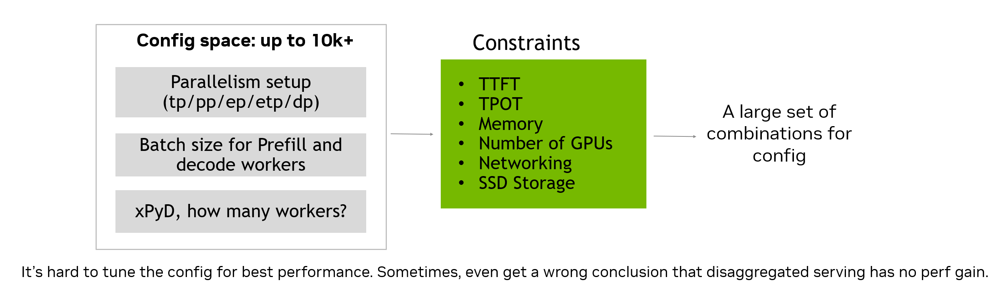
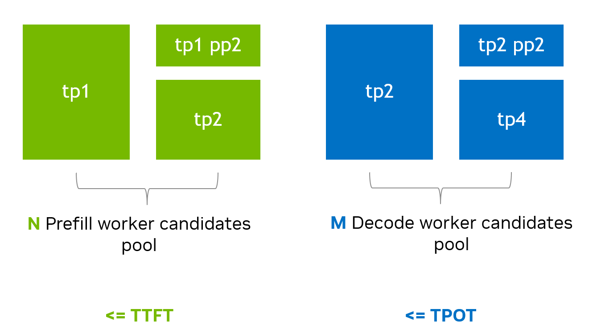
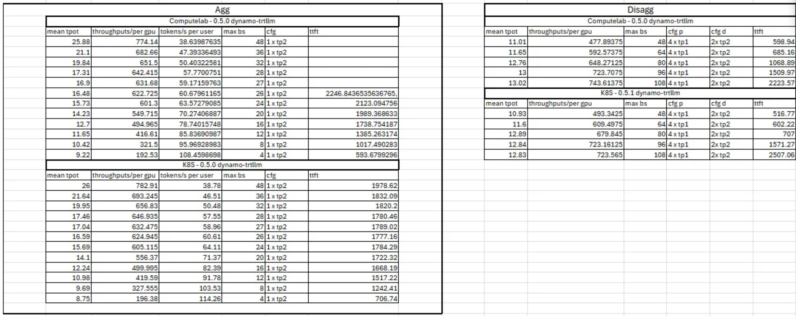
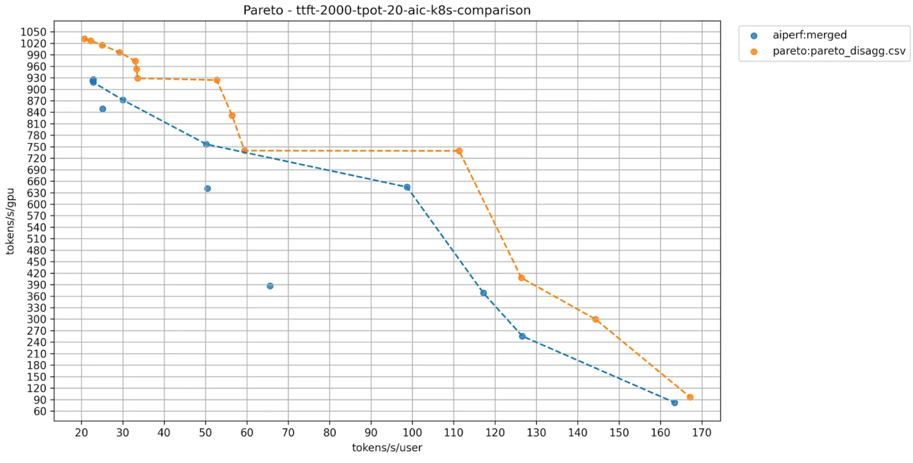
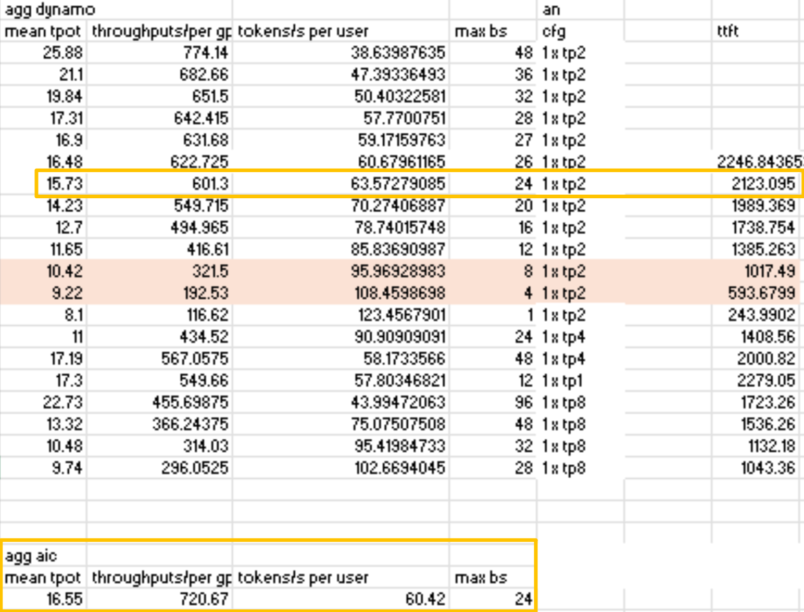
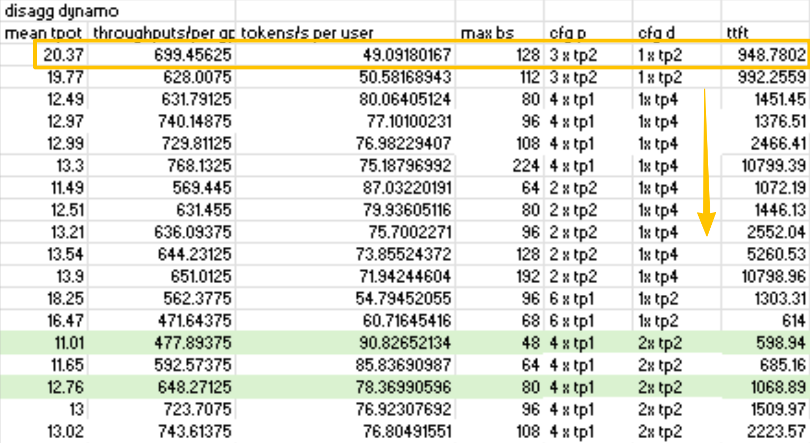

# Advanced Disagg Perf Tuning 
## Challenges in Disaggregated Serving Deployment
__Challenge1__ – Is disaggregated serving always better than aggregated serving? How much perf gain is reasonable?

A: For example, considering __ISL:OSL=1:4000__, do we have perf gain by using disaggregated serving? – __NO__

__Challenge2__ – How to configure disaggregated serving to solve the problem __throughput @ latency__

- Parallelism of the worker
- How many p and d
- Depend on ISL, OSL, TTFT, TPOT
- The tuning efforts are tremendous

## Disagg pd QPS Matching Methology 
### We can firstly __find a worker that meets SLA and under constraints__

- Enumerate parallelism combination of a worker, tp x pp x attn dp x moe tp x moe ep
- Find max batch size of the worker which meets TTFT and TPOT respectively (Disagg is awesome! We can achieve this separately)
- Ensure there's no OOM

### __Match__ the N prefill worker candidates with M decode worker candidates in view of __sequence throughput seq/s__

- Seq/s of prefill = how many sequences I can process and finish context phase per second => __producer__
- Seq/s of decode = how many sequences I can process and finish the whole generation phase per second => __consumer__
- The throughput should __match__ between xP and yD
- Finally, sweep X and Y for a given (prefill, decode) worker combination, find the best seq/s/gpu, thus the best tokens/s/gpu

# agg/disagg best perf tuning based on AIC
## Case Study
### Settings
- model: qwen3-32b-fp8-per-block
- ISL:OSL = 4000/500
- TTFT SLA = 6000/1200 ms
- TPS/user SLA >= 60
- disable prefix caching

### AIC based full automation deployment 
[AIC automation deploy guide](https://github.com/ai-dynamo/aiconfigurator/blob/main/docs/dynamo_deployment_guide.md)

### local deployment vs. k8s deployment 

### AIC projection and ai-perf actual run allignment 

What's the problem here: this tps/user - tps/gpu pareto plot __does not have TTFT info at all__ while TTFT one of the most important SLAs

### Manual fine tuning based on AIC suggestions 
__agg allignment__ 

TTFT estimation is complicated. 
Currently AIC can handle TTFT from engine execution, but not other online serving overheads, say request queuing

actual TTFT is higher than expected, so we're supposed to reduce `max_batch_size` with `TP2` to meet TTFT SLA

We did look around with other combinations of `TP_size` and `max_batch_size` and AIC was right, `TP2` is the best choice

__disagg allignment__ 

Actual run based on AIC's suggestion is noted in yellow, as we can observe, tps/user is a little bit less than SLA requirement (60), which means we need more decode wokers and to tune decode `max_batch_size` (usually equals to `request concurrency`) to enhance decoding capability. 

We fine tuned with more decode GPUs (`2 x tp2` and `1 x tp4`) with corresponding decode worker `max_batch_size` and prefill worker `parallism setting` and we found best disagg config __within minimum search area__ 

__Conclusion__ 

Based on AIC run and minimum manual fine tuning process 

- Under TTFT constraint of 600 ms, disagg delivers a __148%__ tps/gpu perf gain over agg

- Under TTFT constraint of 1200 ms, disagg delivers a __102%__ tps/gpu perf gain over agg

We've been working on fine-grained AIC perf allignment, advanced feature such as prefix caching modeling, vllm/sglang (including wide ep) backend supports etc. Stay tuned!

__Corresponding recipe__

https://github.com/ai-dynamo/dynamo/tree/main/recipes/qwen3-32b-fp8

